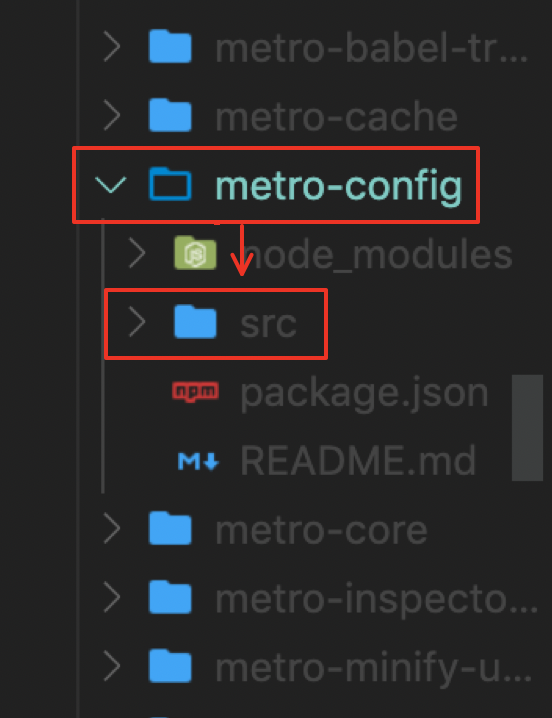
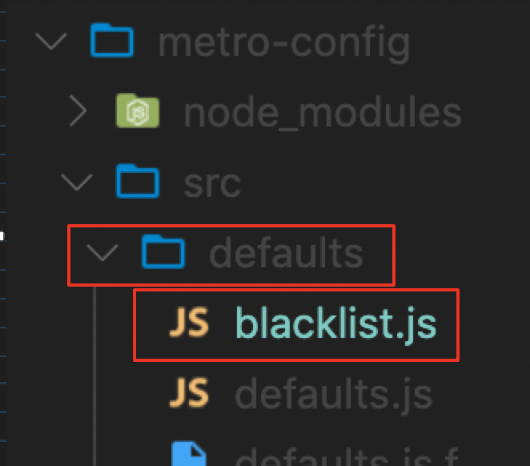
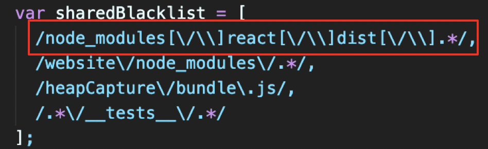
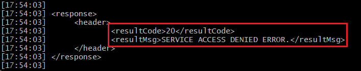
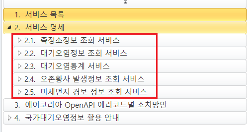
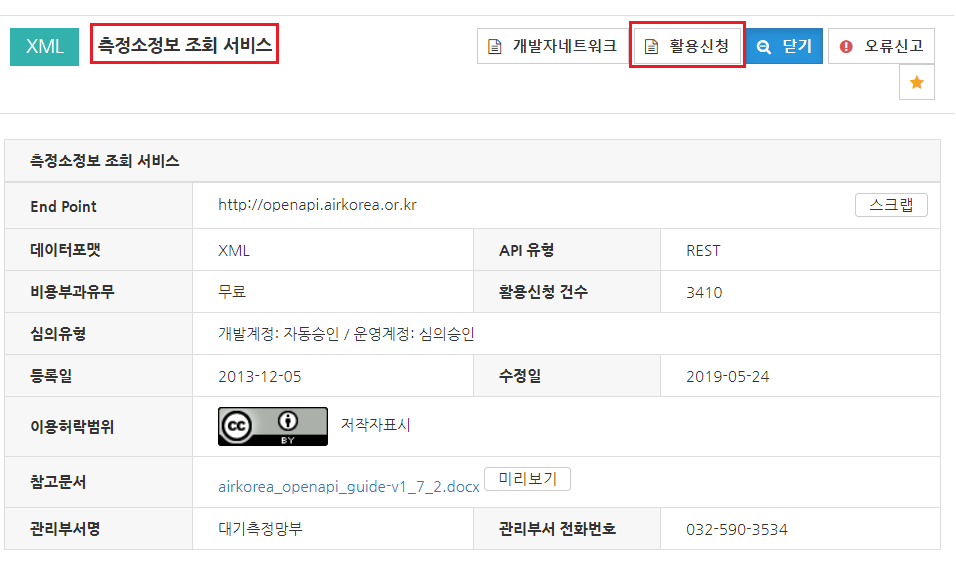

## ISSUE

1. If used windowOS, Excute expo-cli project You Must apply this process.

   

   <pre> Find "node_modules" foler.</pre>

   

   <pre> Find "metro-config/src" foler</pre>

   

   <pre> Find "blacklist.js" foler</pre>

   

   <pre> Modified this area.</pre>

2. If you get the following error when calling the fine dust API, refer to the following.

   

   <pre> Check the error message.</pre>

   

   <pre>Check the service you will use.</pre>

   

   <pre>Make sure you apply for the service you want to use</pre>
